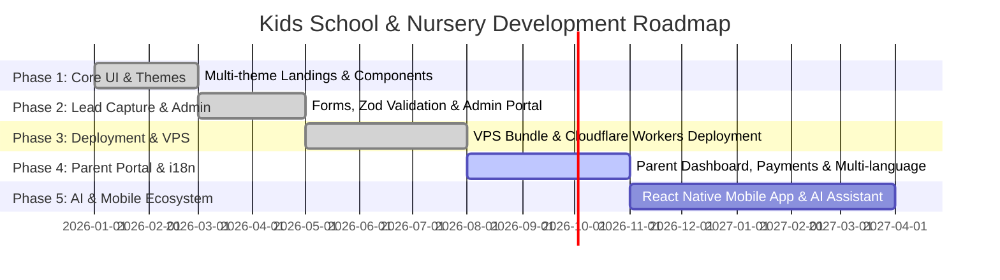

# 🎨 Kids School & Nursery Web Application

[](https://kids.hsini.dev)
[](https://github.com/hsinidev/kidsshool)
[](https://nextjs.org/)
[](https://react.dev/)
[](https://tailwindcss.com/)
[](https://www.prisma.io/)

A vibrant, modern, high-performance web platform designed for early childhood education centers, preschools, nurseries, and daycares. Built using **Next.js 16 (App Router)**, **React 19**, **TypeScript**, **Tailwind CSS v4**, **Framer Motion**, and **Prisma ORM**.

---

## 🌐 Live Application

- **Live URL**: **[https://kids.hsini.dev](https://kids.hsini.dev)**
- **Author**: **[hsinidev](https://hsini.dev)**
- **GitHub Repository**: **[https://github.com/hsinidev/kidsshool](https://github.com/hsinidev/kidsshool)**

---

## 🗺️ Comprehensive Project Roadmap



### ✅ Phase 1: Core Architecture, Responsive UI & Multi-Theme Layouts (Completed)
- [x] **Next.js 16 & React 19 App Router Setup**: Modern file-based routing architecture with Server Components.
- [x] **4 Dynamic Homepage Variations**:
  - Main Landing (`/`): Classic homepage featuring hero slider, program overview, and core values.
  - Layout Variant 2 (`/home2`): Modern centered hero with expanded curriculum cards.
  - Layout Variant 3 (`/home3`): Playful layout focusing on visual activity galleries.
  - Layout Variant 4 (`/home4`): Admissions & inquiry-driven layout.
- [x] **Responsive Design System**: Tailored using Tailwind CSS v4, custom glassmorphism design tokens, and CSS variables.
- [x] **Micro-Animations & Interactive Components**:
  - `MagicSpells.tsx`: Floating sparkles, interactive cursor effects, and subtle particle physics.
  - `HeroSlider.tsx`: Smooth automatic hero slide transitions with Framer Motion.
  - `Decorations.tsx`: Colorful SVG background decorations and playful divider shapes.
- [x] **Dedicated Content Pages**:
  - 📖 **Curriculum**: `/curriculum` & `/course-categories`
  - 🎨 **Activities & Gallery**: `/activities` & `/gallery`
  - 🏫 **Campus Facilities**: `/facilities` & `/playground`
  - 🥗 **Nutrition & Healthy Dining**: `/nutrition`
  - 🚌 **Transportation & Safety**: `/transportation` & `/child-safety`
  - 🙋 **FAQ & Information**: `/faq` & `/about`

### ✅ Phase 2: Lead Capture & Admin Management Portal (Completed)
- [x] **Interactive Enrollment & Inquiry Forms**:
  - `/registration`: Full child registration form.
  - `/ask-us`: Direct parent contact & quick inquiry form.
- [x] **Server-Side Validation & Security**:
  - Zod schema validation for client and server inputs.
  - Asynchronous Next.js Server Actions (`src/app/actions/contact.ts`).
- [x] **Database Persistence Layer**:
  - Prisma ORM 6 integration with SQLite (`dev.db`) and Cloudflare D1 compatibility.
  - Structured `Lead` schema storing parent name, email, phone, child age group, and inquiry message.
- [x] **Secured Admin Portal (`/admin5467`)**:
  - Authenticated login interface (`AdminLogin.tsx`).
  - Interactive data grid (`AdminTable.tsx`) featuring search filtering, status tagging (Pending, Contacted, Enrolled), and record deletion via Server Actions (`src/app/actions/admin.ts`).

### ✅ Phase 3: Production Deployments & VPS Bundling (Completed)
- [x] **Cloudflare Workers / Pages Integration**:
  - Built using `@opennextjs/cloudflare` and `wrangler`.
  - Edge database compatibility via D1 and Prisma Driver Adapters.
- [x] **Standalone Node.js VPS Package (`vps_out/`)**:
  - Self-contained production build directory featuring `server.js`, `vps_out.zip` (54MB bundle), and PM2 configuration.
  - Shell execution script (`start_vps.sh`) and PM2 ecosystem file (`ecosystem.config.js`).
- [x] **Custom Domain Configuration**:
  - Successfully mapped and served at **[kids.hsini.dev](https://kids.hsini.dev)**.

### 🟡 Phase 4: Parent Portal, Payments & i18n (Q3 - Q4 2026)
- [ ] **Authenticated Parent Portal**:
  - Secure parent login for viewing child daily activity logs, attendance, and teacher reports.
- [ ] **Online Tuition & Fee Payment System**:
  - Stripe and PayPal API integrations for online enrollment deposits and monthly tuition billing.
- [ ] **Multi-Language Support (i18n)**:
  - Internationalization support for English, Arabic, French, and Spanish.
- [ ] **Automated Notification System**:
  - Resend email alerts and Twilio WhatsApp/SMS notifications for submitted inquiry leads.

### 🔵 Phase 5: Smart AI & Mobile App Ecosystem (2027)
- [ ] **AI Early Learning Assistant**:
  - AI-driven chatbot for instant parent Q&A regarding curriculum, schedules, and admissions.
- [ ] **Cross-Platform Mobile App**:
  - React Native / Flutter application for instant push notifications, live photo updates, and child drop-off/pick-up QR verification.

---

## 🚀 Tech Stack

| Layer | Technology |
| :--- | :--- |
| **Framework** | [Next.js 16](https://nextjs.org/) (App Router) |
| **UI Library** | [React 19](https://react.dev/) |
| **Language** | [TypeScript](https://www.typescriptlang.org/) |
| **Styling** | [Tailwind CSS v4](https://tailwindcss.com/) |
| **Animations** | [Framer Motion 12](https://www.framer.com/motion/) & [Lucide React Icons](https://lucide.dev/) |
| **Form Handling** | [React Hook Form](https://react-hook-form.com/) + [Zod Schema Validation](https://zod.dev/) |
| **Database & ORM** | [Prisma ORM 6](https://www.prisma.io/) (SQLite `dev.db` / Cloudflare D1) |
| **Deployment Engine** | Cloudflare Workers (`@opennextjs/cloudflare`), PM2 / Nginx Node.js VPS |
| **Live Host** | **[kids.hsini.dev](https://kids.hsini.dev)** |

---

## 📸 Core Pages & Navigation

- 🏠 **Home Variants**:
  - `https://kids.hsini.dev/` - Classic Nursery Landing
  - `https://kids.hsini.dev/home2` - Modern Preschool Landing
  - `https://kids.hsini.dev/home3` - Activity & Play Landing
  - `https://kids.hsini.dev/home4` - Admissions Focused Landing
- 📚 **Academic & Curriculum**:
  - `https://kids.hsini.dev/curriculum` - Full Learning Curriculum Breakdown
  - `https://kids.hsini.dev/course-categories` - Age Group Categories
- 🧸 **Life & Facilities**:
  - `https://kids.hsini.dev/activities` - Daily Student Activities
  - `https://kids.hsini.dev/facilities` - Campus Infrastructure
  - `https://kids.hsini.dev/playground` - Outdoor & Indoor Play Areas
  - `https://kids.hsini.dev/nutrition` - Healthy Meals & Dining Plans
  - `https://kids.hsini.dev/transportation` - Bus Service Routes & Safety
  - `https://kids.hsini.dev/child-safety` - Health & Safety Protocols
- 📩 **Parent Inquiries & Admissions**:
  - `https://kids.hsini.dev/registration` - Child Registration Form
  - `https://kids.hsini.dev/ask-us` - Inquiry Contact Form
- 🔐 **Administration**:
  - `https://kids.hsini.dev/admin5467` - Lead Management & Inquiry Dashboard

---

## 📁 Project Directory Structure

```text
kidsshool/
├── prisma/
│   ├── schema.prisma         # Prisma ORM schema (Lead & AdminUser models)
│   └── migrations/           # Database migration files
├── public/
│   ├── images/               # Optimized assets for activities, facilities, teachers
│   └── favicon.ico           # Website icon
├── src/
│   ├── app/
│   │   ├── about/            # About Us page
│   │   ├── actions/          # Next.js Server Actions (admin.ts, contact.ts)
│   │   ├── activities/       # School activities gallery page
│   │   ├── admin5467/        # Secured Admin Portal dashboard
│   │   ├── ask-us/           # Quick Inquiry form page
│   │   ├── child-safety/     # Child safety protocols page
│   │   ├── course-categories/# Learning categories page
│   │   ├── curriculum/       # Curriculum details page
│   │   ├── events/           # School events calendar
│   │   ├── facilities/       # Facilities & campus tour page
│   │   ├── faq/              # Frequently asked questions
│   │   ├── gallery/          # Interactive image gallery
│   │   ├── home2, home3, home4/# Alternative homepage variations
│   │   ├── nutrition/        # Meals & dietary plans page
│   │   ├── registration/     # Child enrollment registration page
│   │   ├── transportation/   # Bus service details page
│   │   ├── globals.css       # Tailwind CSS v4 global styles & custom theme tokens
│   │   ├── layout.tsx        # Root layout & providers
│   │   └── page.tsx          # Main Landing Page
│   ├── components/           # Reusable UI components
│   │   ├── Header.tsx        # Main navigation header with mobile drawer
│   │   ├── Footer.tsx        # Footer with quick links & contact details
│   │   ├── AdminTable.tsx    # Admin lead data grid & status management
│   │   ├── AdminLogin.tsx    # Admin login screen component
│   │   ├── MagicSpells.tsx   # Interactive floating particle animation overlay
│   │   ├── HeroSlider.tsx    # Homepage main hero carousel
│   │   └── Decorations.tsx  # Wave dividers & decorative SVGs
│   └── lib/
│       └── db.ts             # Prisma client instance with SQLite/D1 adapters
├── vps_out/                  # Production Node.js VPS standalone output package
│   ├── .next/                # Optimized Next.js server production build
│   ├── dev.db                # SQLite production database file
│   ├── ecosystem.config.js   # PM2 process manager configuration
│   ├── package.json          # Production standalone dependencies
│   ├── README_VPS.md         # Detailed VPS deployment guide
│   ├── server.js             # Custom Express/Node.js standalone HTTP server
│   ├── start_vps.sh          # One-click shell deployment script
│   └── vps_out.zip           # Compressed 54MB complete deployment archive
├── open-next.config.ts       # OpenNext Cloudflare configuration
├── wrangler.toml             # Cloudflare Workers / Pages configuration
├── next.config.ts            # Next.js configuration
├── package.json              # Main project scripts & dependencies
├── tsconfig.json             # TypeScript configuration
└── README.md                 # Complete project documentation & roadmap
```

---

## 🛠️ Local Development Setup

### Prerequisites

- **Node.js**: v18.17.0+ or v20.0.0+
- **npm** (or `pnpm` / `yarn`)

### 1. Clone Repository & Install Dependencies

```bash
git clone https://github.com/hsinidev/kidsshool.git
cd kidsshool
npm install
```

### 2. Configure Environment Variables

Create a `.env` file in the root directory:

```env
DATABASE_URL="file:./dev.db"
ADMIN_SECRET_KEY="your_secure_admin_key"
RESEND_API_KEY="your_resend_api_key_optional"
```

### 3. Initialize Prisma Database

Generate the Prisma client and push the schema to local SQLite database (`dev.db`):

```bash
npx prisma db push
```

### 4. Run Development Server

```bash
npm run dev
```

Open **[http://localhost:3000](http://localhost:3000)** in your browser.

---

## ⚡ Production Deployment Guides

### Option A: Deployment on Node.js VPS (Using `vps_out`)

The repository includes a ready-to-run production deployment package in the `vps_out/` directory.

#### Step 1: Upload `vps_out.zip` to your VPS

```bash
scp vps_out/vps_out.zip user@your-vps-ip:/var/www/kidsshool/
```

#### Step 2: Extract & Install Dependencies on VPS

```bash
cd /var/www/kidsshool
unzip vps_out.zip
npm install --production
```

#### Step 3: Start Application with PM2

```bash
pm2 start ecosystem.config.js
pm2 save
pm2 startup
```

#### Step 4: Configure Nginx Reverse Proxy for `kids.hsini.dev`

Create `/etc/nginx/sites-available/kids.hsini.dev`:

```nginx
server {
    server_name kids.hsini.dev;

    location / {
        proxy_pass http://127.0.0.1:3000;
        proxy_http_version 1.1;
        proxy_set_header Upgrade $http_upgrade;
        proxy_set_header Connection 'upgrade';
        proxy_set_header Host $host;
        proxy_cache_bypass $http_upgrade;
    }
}
```

Enable configuration and issue SSL:

```bash
ln -s /etc/nginx/sites-available/kids.hsini.dev /etc/nginx/sites-enabled/
nginx -t
systemctl reload nginx
certbot --nginx -d kids.hsini.dev
```

---

### Option B: Deployment on Cloudflare Workers / Pages

The platform supports serverless edge deployment using `@opennextjs/cloudflare`:

```bash
# Build Cloudflare package
npm run pages:build

# Deploy to Cloudflare Workers
npx wrangler deploy
```

---

## 🔐 Admin Dashboard Access

1. Visit **[https://kids.hsini.dev/admin5467](https://kids.hsini.dev/admin5467)**.
2. Enter the administrator credentials.
3. Manage incoming parent inquiries, change status tags, filter by date/age group, or export lead data.

---

## 👨‍💻 Author & Maintainer

<table align="center">
  <tr>
    <td align="center">
      <a href="https://hsini.dev">
        <br />
        <sub><b>Hsini Mohamed</b></sub>
      </a><br />
      👑 Full-Stack Developer & SaaS Architect<br />
      🌐 <a href="https://hsini.dev">hsini.dev</a> | 📧 <a href="mailto:contact@hsini.dev">contact@hsini.dev</a> | 🐙 <a href="https://github.com/hsinidev">@hsinidev</a>
    </td>
  </tr>
</table>

---

## 📄 License

Distributed under the MIT License. See `LICENSE` for more information.

<p align="center">Developed with ❤️ by <a href="https://hsini.dev">Hsini Mohamed</a></p>

